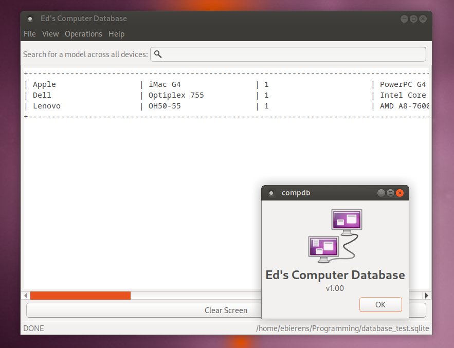

# EdsComputerDatabase
I, Edward Bierens, work with computers for a hobby. However, it can be incredibly hard to track what the entire collection contains, so it would be helpful to have a database to keep track of everything. This is where this program comes in, as it will allow an easy frontend for a computer database to quickly add, view, remove, and update entries for each computer.

## Important Changes
There are two important deviations made from the original proposal I wish to highlight:

- Rather than running on Qt6, it was decided that this software will use GTK3 along with Glade, a GUI builder that creates XML-styled files for GTK Builder (integrated in GTK3) to initialize and pull elements from.

- There was no protection from there being duplicate computers. To fix this, a seperate ID column was created in all tables except for Status. Think of it as "Computer Model, first computer; Computer Model, second computer," as I have a few computers where there would be duplicates (such as a couple of Dell Latitude D620s).

## Requirements
This was developed on Debian 12, so this guide will be for installing it on systems similar to it such as Ubuntu, Linux Mint, and even other Debian systems. Ensure the following packages are installed:

- `build-essential`
- `make`
- `libgtk-3-dev`
- `libsqlite3-dev`

As for non-Debian Linux Distributions, equivalent packages should exist and work just fine. For Windows users, you will need to install MSYS2, use mingw64 or ucrt to set up an environment along with the equivalent packages, and build from there, though it is not designed to work with Windows and you will likely come across errors.

One thing that much also be done is initializing a database. Located within the `sql` folder exists an sql file to initialize every table as well as example rows. Ed's Computer Database does not create a file of its own, but assumes one already exists.

You must also download this repository, either by running git clone or manually downloading and extracting the zip file. The commands in the next two sections will assume you are in the root of the repository.

## Setting Up
Simply run `make` in the root of this repository, and it will automatically generate a folder called `bin` containing the executable and the Glade XML file needed to generate the GUI. It is important that those two files never get seperated, otherwise the program will not work properly.
